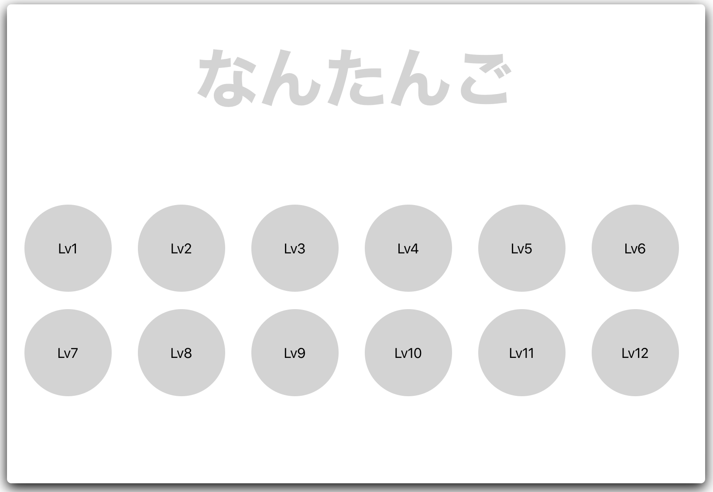
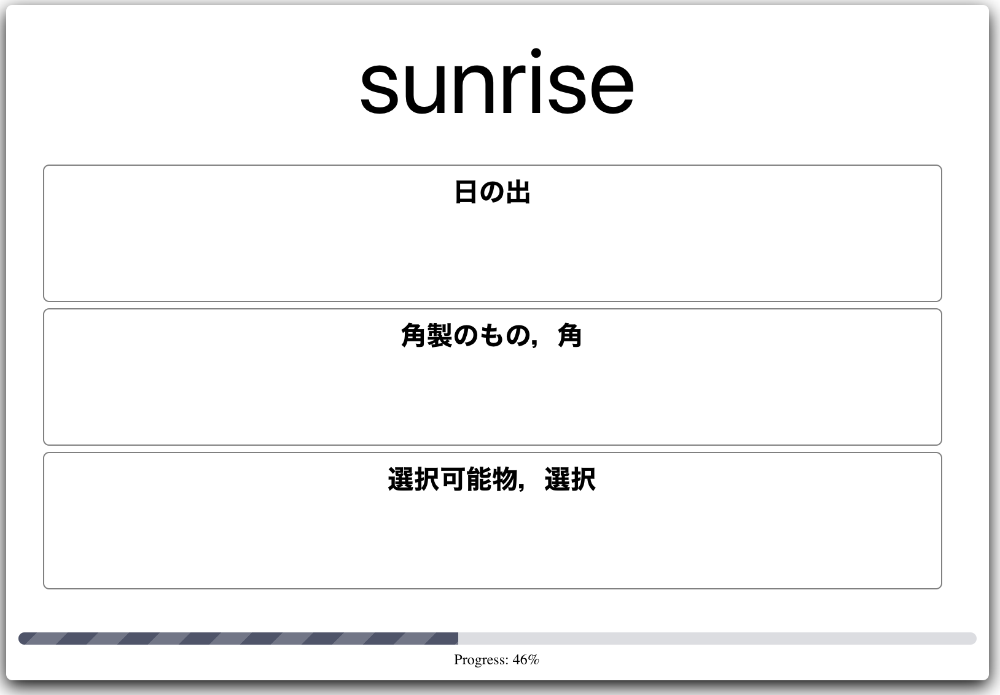
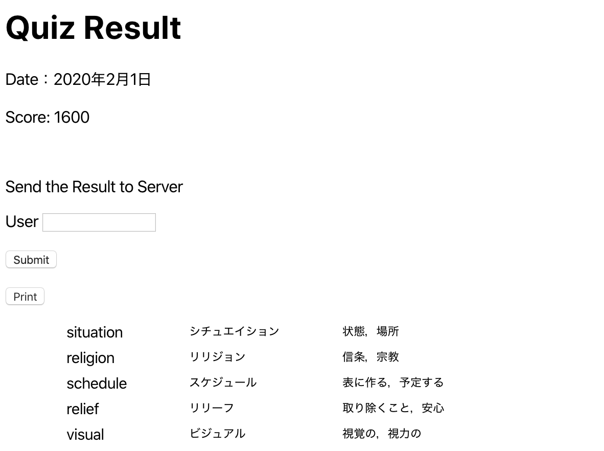

# Nantango

## Screens

| Top | Quiz | Result |
|:---:|:---:|:---:|
||||


## Setting up

```bash
$ git clone git@github.com:t-cool/nantango-react.git
$ cd nantango-react
$ npm install
```

## Start the app

```bash
$ npm run start
```

## Build the app

```bash
$ npm run build
```

Then the app is published in `build` folder.

## License

[The GNU General Public License v3.0](https://www.gnu.org/licenses/gpl-3.0.en.html)